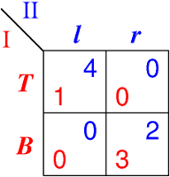

# Strategic form display and file format

Date: 23 May 2016

Part of this extends and re-uses material from
[INFOS/start_GSOC_2016.md](../INFOS/start_GSOC_2016.md).

## Terminology

The strategic form is one of the basic models of game
theory.

Another standard term is *normal form*.
Because "normal" is not a very descriptive word, leading
game theorists (such as Sergiu Hart, in the Handbook of Game
Theory that of which he co-edited the first three volumes
with Bob Aumann) strive to establish the term *strategic
form* instead, and we should do so too.
Hence, the shorthand SF suggests itself.

One of the problems is that SF is also a possible
abbreviation for the *sequence form* which is another,
different strategic description, which is derived from
the *extensive form* (a game tree). Unlike the strategic
form, the sequence form has the same size as the game tree.
The sequence form is very useful for solving game trees of
large (and even medium) size and we will use it.

So it seems that we have convenient abbreviations EF, NF, SF
for extensive form, normal form, and sequence form.
However, we should not re-introduce "normal form" for this
purpose only. In addition, the sequence form is not well
known, nor is the abbreviation "SF" for "sequence form".

I suggest the following alternatives (for discussion):

* EF for extensive form
* SF (or possibly STF) for strategic form (also known as normal form)
* QF (or possibly SQF) for the seQuence form

Further common abbreviations:

* NE for Nash equilibrium
* SPNE for subgame perfect Nash equilibrium.

## Definition

The SF (strategic form) is specified by a set of
N *players*, each of which has a nonempty set of
*strategies*, and *payoffs* defined for each player as
follows.
N is a positive integer.
A *strategy profile* is an N-tuple of strategies, one for
each player.
The SF specifies a payoff to each player for each strategy
profile.

In our computational setting, the sets of players and their
strategies are all finite, payoffs are rational numbers
(in the theory, real numbers).

The strategic form can be considered either as

* a primitive, that is, a given game structure on its own, or
* *derived* from an EF (extensive form) game.

EF games are often converted to SF in order to study
concepts like NE (Nash equilibrium), or to compute a NE.

### Names of strategies and players

In order to display a SF game, players and strategies should
have *names*.

In JS, these names could be used to index the N-dimensional
array that defines the SF.
However, the order of these names should not prescribe the
order in which they appear.
We will therefore *number* the strategies as nonnegative
integers (starting from 0), and keep their names separately.

Players should also have names.
We number players with 1, 2, 3 and so on.
Player 0 is the special *chance player* in an EF game.

The following is an example of a two-player game.

 

The strategic form is a table that lists STRATEGIES for each
player (rows for player 1, columns for player 2) and the
payoff to each player in the resulting cell.

For 3 players, there will be an additional choice of PANELS
for player 3, and each cell has 3 payoffs.

For 4 players, there will be rows of PANELS for player 3 and
columns of PANELS for player 4, and each cell has 4 payoffs.
While we will probably not use them, the potential
generality should be kept in mind.
E.g. we should not hardwire "2 players" into the payoff
vectors.

**IMPORTANT**:
The strategic form is DERIVED from the game tree, and
alternatively can be CREATED separately.

At the moment, there is no strategic form at all.

A basic solver for strategic-form games (which for two
players are called *bimatrix games*) is at 
http://banach.lse.ac.uk

The strategic form is also the basis for the display of
equilibrium diagrams (for Amelie).

We have to get basic input of strategic form games going
quickly. 
The display should be done as in GTE (which looks nice)
and is not too hard.
Game matrices can be input with input boxes.

Issue 3:

WYSIWIG input by with TAB and RETURN keys as in
spreadsheets.

Issue 4:

Creation of the set of STRATEGIES from the extensive form.
A strategies specifies a move for EVERY information set of
the player. When the info set cannot be reached due to an
OWN earlier move, then the move is left blank (or
represented with a "*"; display should be configurable).
The natural order of strategies requires an order, typically
breadth-first of the info sets of the player, because that
is the order in which the moves appear in the strategy.
Move names (such as "L" and "R") are allowed to appear for
different nodes, but are identified by their respective
info set; that correspondence must be clear.

The strategic form should appear on a separate canvas.
It would be nice if this appears (in small) next to the game
tree, or in a separate popup window (configurable? later)
while the game tree is created.
Changing a payoff will the immediately result in changes in
the strategic form (typically in more than one place as the
strategic form is rather redundant in that respect, much
more cells than game tree leaves).

Design requirement:

make top left corner of strategic form diagram (= endpoint
of diagonal separator) reference coordinate (0,0) like in
bimatrixgame.sty

